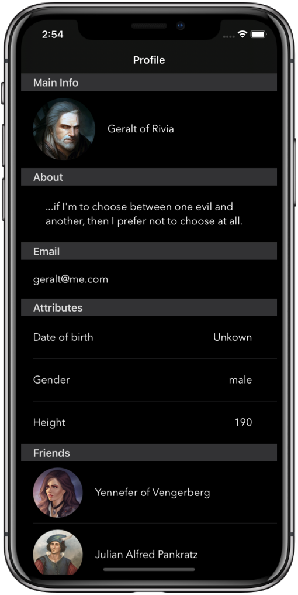

# TableView MVVM &middot;   <a href="https://twitter.com/filipedonadio"></a>

This project is an example of a profile screen commonly used in many apps. The screen is built using a `UITableView` with different table cell types, and MVVM as a design pattern.



## The problem

Usually, the approach to implement this behaviour is to add `if` statements inside `cellForRowAt` method:

```swift
func tableView(_ tableView: UITableView, cellForRowAt indexPath: IndexPath) -> UITableViewCell {
    
    if indexPath.row == 0 {
        // Dequeue cell 1
    } else if indexPath.row == 1 {
        // Dequeue cell 2
    }
    ...
}
```

While that works for small projects, we might have problems when reordering the cells, or adding new cells to the table. Also it's not clearly readable leading to messy code 😿

## A better way

In this project, I'm using the MVVM pattern to separate the table data source from the view layer. Each cell has a `type` property making very easy to identify them making the code more readable and scalable.

Following this approach, our `cellForRowAt` can be used like this:

```swift
func tableView(_ tableView: UITableView, cellForRowAt indexPath: IndexPath) -> UITableViewCell {
    
    let item = items[indexPath.section] // Array of different cell types
        
    switch item.type {
    case .nameAndPicture:
        if let cell = tableView.dequeueReusableCell(withIdentifier: NamePictureCell.identifier, for: indexPath) as? NamePictureCell {
            cell.item = item
            return cell
        }
    case .about:
        if let cell = tableView.dequeueReusableCell(withIdentifier: AboutCell.identifier, for: indexPath) as? AboutCell {
            cell.item = item
            return cell
        }
    ...
}
```